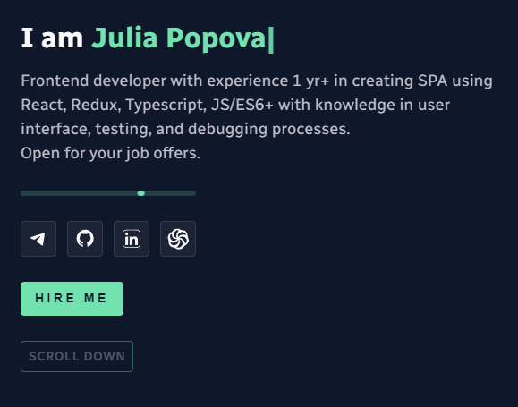
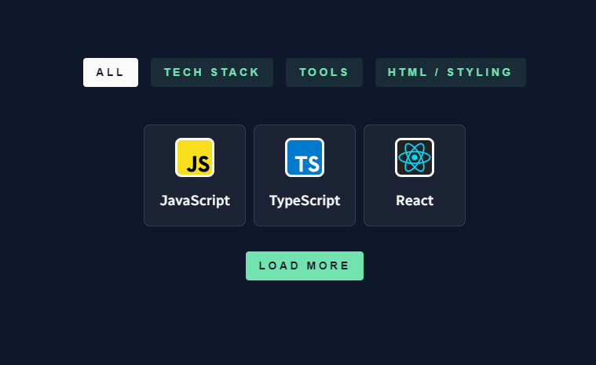
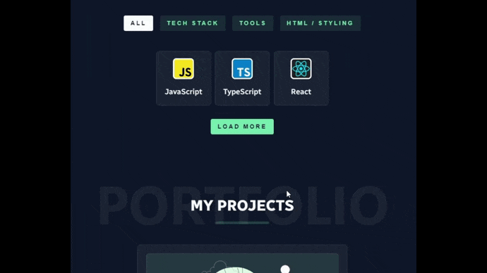
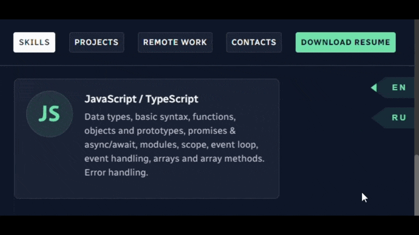
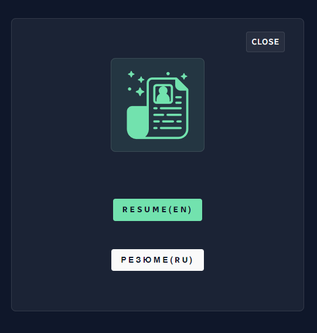
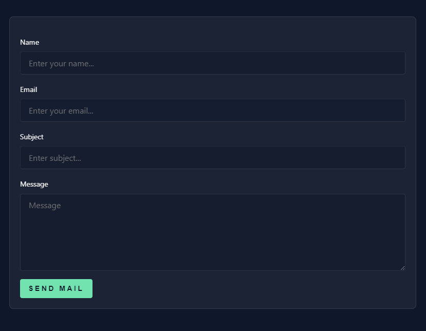

# :briefcase: My portfolio project 

My name is Julia Popova, and I am a skilled front-end developer with over 1 year of experience. I specialize in creating single-page applications using React, Redux, TypeScript and JS/ES6+. My main focus is on user interface design and ensuring a seamless user experience.

I have a strong passion for continuous learning and personal growth, and I am always seeking opportunities to expand my skill set. Currently, I am actively pursuing knowledge in React Native, Angular, Next.js to broaden my expertise and stay up to date with the latest industry trends.

:link: More details about my skills and examples of projects can be found in the [PORTFOLIO](https://veluat.github.io/portfolio-app/).
___
:white_check_mark: The site design is concise and understandable.


___
### The following libraries are included in the project
* react
  * react-dom
  * react-alice-carousel
  * react-parallax-tilt
  * react-reveal
  * react-typing-effect
  * react-scroll
* javascript
* formik
* sass
* uuid
* framer-motion
* emailjs/browser
___
:white_check_mark: The portfolio project has implemented several interesting features.
It is possible to gradually load parts of skills so as not to overload the visual part of the site for the client if he does not want to see all the skill icons at once.



:white_check_mark: Also implemented is the ability to filter skills by category and ability to collapse open icons to three items.



:white_check_mark: Demo projects and source code can be found in the projects section, designed in the form of a carousel for a compact style that does not overload your attention.


:white_check_mark: Added API context and LanguageDetector and LanguageSwitcher inside LocaleProvider, allowing user language detection and application locale control.
The LanguageHandler component is placed inside the LocaleContext. Provider to handle saving and restoring the user's preferred language. When the LanguageHandler component detects a stored language in localStorage, it will call the setLocale function from the LocaleContext to set the stored language.
```javascript
export const LanguageHandler = () => {
    const { setLocale } = useContext(LocaleContext)
    const [storedLocale, setStoredLocale] = useState(null)

    useEffect(() => {
        const savedLocale = localStorage.getItem('preferredLocale')
        if (savedLocale) {
            setStoredLocale(savedLocale)
            setLocale(savedLocale)
        }
    }, [setLocale])

    useEffect(() => {
        if (storedLocale) {
            localStorage.setItem('preferredLocale', storedLocale)
        }
    }, [storedLocale])

    return null
}
```
:white_check_mark: At any time, the user can choose the interface language he wants.



:white_check_mark: The user also has the opportunity to download my resume for review in English or Russian.



:hearts: I hope through my portfolio you can learn more about my skills.
Also, at any time you can contact me through any of the social networks or through the feedback form.



